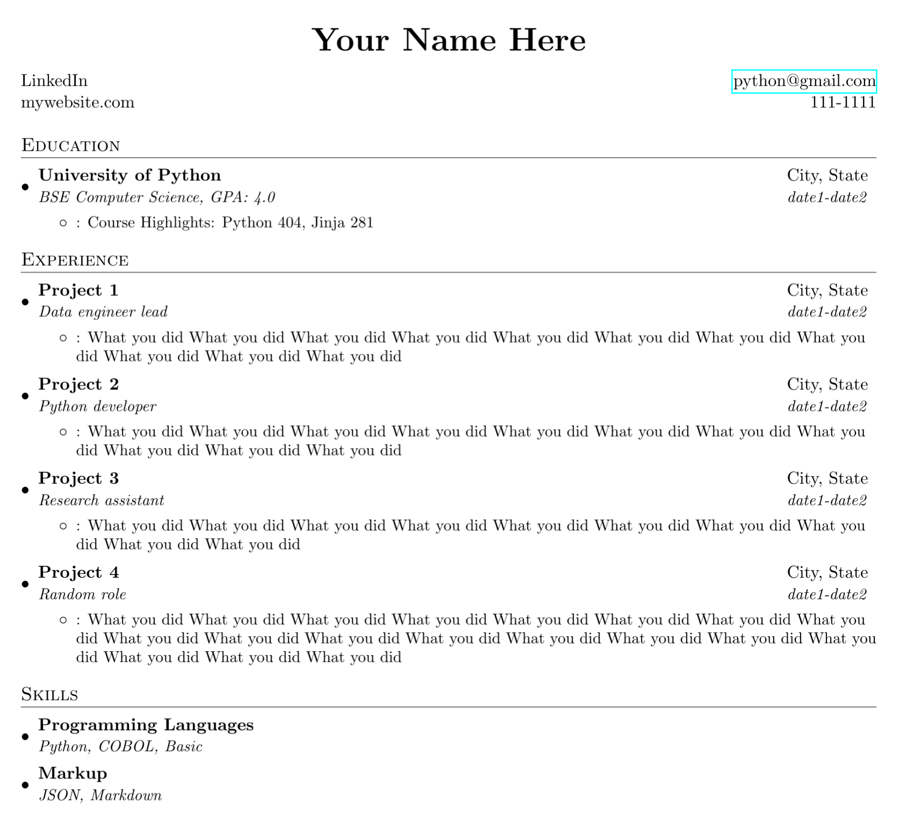

# Resumator

A simple python-automated resume using jinja2 templating. The idea is to simplify the formatting process and make dynamic changes using the minimalistic Markdown format that are carried over to a finalized LaTeX-generated pdf.
This module defaults to scraping data from a markdown file named "Resume.md" that can be used to input information. It can also be configured to read from a JSON file of the resume information.



Table of contents
=================

<!--ts-->
   * [Resumator](#resumator)
   * [Table of contents](#table-of-contents)
   * [Installation](#installation)
     * [Automated](#automated)
     * [Manual](#manual)
   * [Usage](#usage)
   * [Schema](#schema)
     * [Markdown Schema](#markdown-schema)
     * [JSON Schema](#json-schema)
   * [Contact](#contect)
<!--te-->

## Installation

### Automated

It is recommended that you run the build script to expedite setup:

`./build`

If the script does not run, you may have to run:

`chmod +x build resumator clean`

If you run into any more errors, try manually installing the dependencies.

### Manual

First, set up and activate the virtual environment: 

`python3 -m venv env && source env/bin/activate`

Install the dependencies through pip:

`pip install -r requirements.txt`

This module uses `latexmk` instead of `pdflatex` to output pdf files. Many linux distros already have this installed, but if not, you can run:

**Debian-based**

`sudo apt install latexmk`

**Arch-based**

`pacman -S latexmk`.

You may also have to install your prefered latex distribution, such as `pdflatex`, which is packaged with most linux distros.
If you are missing the package, run:

**Debian-based**

`sudo apt install pdflatex` 

**Arch-based**

`pacman -S pdflatex`.


## Usage

To run the resumator, simply edit the a Markdown or JSON file to your liking and run `./resumator`.

The resumator script will prompt you for a template name and an input file name.

You can also opt to run the python script directly:
```
Usage: python3 resumator.py [FILE] [OPTIONS]
    -h,--help: open help menu
    -j,--json: use JSON file type
    -t,--template: latex template file name

```

To clear all generated resumes (both .tex and .pdf files), run `./clean`

## Schema

### Markdown Schema

It is recommneded that you use a fully functional Markdown editor such as Typora or Zettlr as an interface to edit your resume.
```
# Name

PHONE: <phone>
EMAIL: <email>
WEBSITE: <website url>
LINKEDIN: <linkedin url>

## Section Name

### Section entry

#### Entry subtitle

- <entry information>
...
- LOCATION: <location>
- DATES: <dates>

```
For a full example, take a look at Sample.md.

### JSON Schema

The JSON schema is similar in layout to the Markdown Schema, as the Markdown files are ultimately parsed to a dictionary.
```
{
  "name": <name>,
  "phone": <phone>,
  "email": <email>,
  "website": <website url>,
  "linkedin": <linkedin url>,
  "sections": [
    {
      "title": <section title>,
      "entries": [
        {
          "title": <entry title>,
          "subtitle": <entry subtitle>,
          "info": [<bullet point 2>, <bullet point 2>],
          "location": <location>,
          "dates": <dates>
        }
      ]
    }
    ...
  ]
}
```
For a full example, take a look at Sample.json.

## Contact

If you want to add to the LaTeX templates available or add new functionality, feel free to reach out to me or submit pull requests!